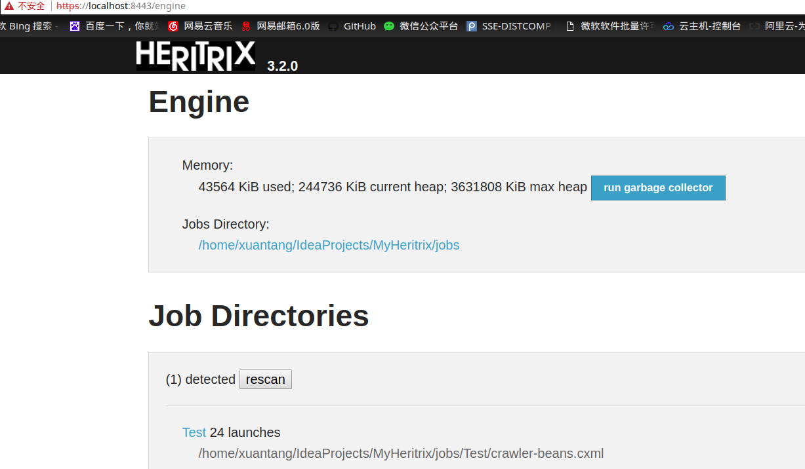

# HeritrixDemo
  Heritrix是由java语言开发的一种开放源代码的网络爬虫框架，对网站内容全部下载，不会修改页面中的任何内容。可以用Heritrix来完整、精确地抓取网站中的资源，包括视频、音频、图像以及其它非文本内容，抓取并把这些内容存储在磁盘中。爬虫通过Web界面启动、监控、控制，允许用户自定义要获取的URL, 采用Spring框架进行设计，实现解耦，有很好的扩展性。

## QuickStart

### Syetem requirements
- Linux 发行版 (windows 官方没有跑通过, 慎重选择！)
- JDK 1.6 (亲测1.7没问题, 1.8由于KeyTool类包名发生变化没法使用)
### Install
- 下载所需要的包[Heritrix](https://builds.archive.org/job/Heritrix-3/lastBuild/org.archive.heritrix$heritrix/)(需要科学上网)
- 打开网页下载heritrix-3.3.0-20171004.235237-94-dist.tar.gz
### Run
- 进入到bin目录  
`cd bin`　　
- 启动Heritrix  
`./heritrix -a admin:admin`
- 在web界面查看https://localhost:8443　　

### Create New Job
- 通过Web配置　　
> 新建任务　　
　　
> 管理任务　　
  
> 配置任务(添加种子)

